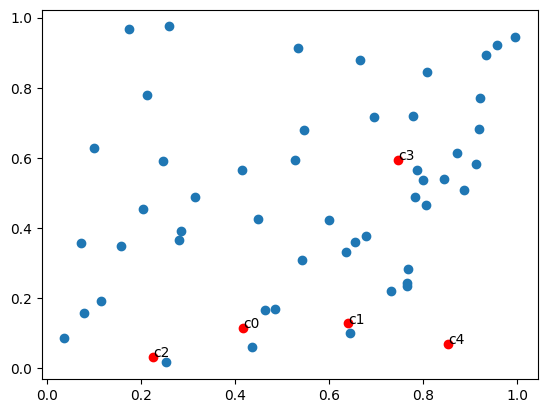
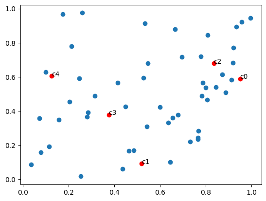

# Comparison of Different Voting Algorithms

[Click here to view the PDF version](../assets/pdf/voting.pdf)

The code related to the analyses and results presented in this paper
  is available online. You can access it at [this colab
  notebook](https://colab.research.google.com/drive/1B8_NaJrncqVtBYtIm5opyBtoYeoFkBgC?usp=sharing).

# Introduction

In the field of voting or social choice, a variety of options, such as
political candidates or possible actions, are presented. A group ---
whether a nation or an organization --- must to make a decision, no
matter it's a winner, a set, or a ranking. This process is guided by the
preferences of the participants, who each submit a ranking of the
options. The challenge lies in the selected social choice rule or
mechanism, which determines the winner based on these rankings.

Numerous social choice rules have been proposed over time, leading to a
comprehensive area of study concentrated on comparing these rules and
determining their effectiveness. Historically, this analysis has been
rooted in the formulation of axioms, dating back to the correspondence
between Borda and Condorcet[^1][^2], that a social
choice rule should satisfy. The effectiveness of a rule can then be
assessed by its adherence to these axioms.

Historically, the study of voting methods has included several classic
algorithms, each known for their unique strengths and weaknesses. Among
the most traditional approaches are the Plurality method and the Borda
count. In the Plurality method, the candidate with the most first-place
votes wins. In the Borda count, candidates are scored based on their
ranks in each voter's list. Although both methods are easy to understand
and implement, they require a significant time commitment and
computational resources to calculate the winner.

From the paper "Communication, Distortion, and Randomness in Metric
Voting"[^3], when we discuss voting methods, it is essential to
consider three critical properties to evaluate the effectiveness of a voting mechanism:

1.  **Low Distortion:** This property refers to the mechanism's ability
    to select a winner that closely represents the optimum candidate,
    minimizing the total dissatisfaction - we defined it as the
    distance - among voters. Low distortion is crucial for ensuring that
    the outcome of the voting process aligns well with the true
    preferences of the voters.

2.  **Low Communication:** This involves minimizing the amount of
    information that voters need to communicate about their preferences.
    Voting mechanisms that require less communication are generally
    easier to implement and less burdensome on voters, making them more
    practical for large-scale or frequent applications.

3.  **Determinism:** A deterministic mechanism always produces the same
    output when given the same input, providing predictability and
    stability in the voting process. While randomness can sometimes help
    in achieving fairness or lowering distortion, deterministic rules
    are often preferred for their transparency and reliability.

Random Dictatorship satisfies the properties of low communication
complexity and low distortion, while basic algorithms such as Plurality
and Borda satisfy the properties of low communication complexity and
determinism.

This paper primarily focuses on the analysis of distortion in various
randomized voting methods and explores the underlying reasons for the
differences in their performance.

# Notation

## Problem Setup

There are some voters and some candidates. Each voter ranks the
candidates in an order of preference. The goal is to select a winner
from the candidates. We assume that the voters' preferences are strict,
i.e., no two candidates are ranked equally by a voter. To simplify
analysis, we assume that each voter nominates top 3 candidates. The
primary goal of the voting mechanism is to select a single winner from
among the candidates based on the aggregated preferences of all voters.

## Distortion

Assume that all voters and candidates are embedded in a pseudo-metric
space $d$. $d(v, x)$ denotes the distance between voter $v$ and
candidate $x$. Being a pseudo-metric, it satisfies non-negativity and
the triangle inequality $d(v, x) \leq d(v, y) + d(v', y) + d(v', x)$ for
all voters $v, v'$ and candidates $x, y$.

A vote profile $P$ is consistent with the metric $d$, and write
$d \sim P$, if $\pi_v(x) < \pi_v(y)$ whenever $d(v, x) < d(v, y)$. That
is, $P$ is consistent with $d$ iff all voters rank candidates by
non-decreasing distance from themselves.

The cost of candidate $x$ is $C(x) = \sum_v d(v, x)$, i.e., the sum of
distances of $x$ to all voters. An optimum candidate is any candidate
$x^*_d \in argmin_{x \in X} C(x)$.

The social choice rule is handicapped by not knowing the metric $d$,
instead only observing the consistent vote profile $P$. Due to this
handicap, and possibly other suboptimal choices, it will typically
choose candidates with higher cost than $C(x^*)$. The distortion of $f$
is the worst-case ratio between the cost of the candidate chosen by $f$,
and the optimal candidate $x^*_d$ (determined with knowledge of the
actual distances $d$). Formally,

$$\rho(f) = \max_P \sup_{d: d \sim P} \frac{C(f(P))}{C(x^*_d)}.$$

## Example

Consider a scenario with 50 voters and 5 candidates randomly placed in a metric space.


*Figure 1: Sample distribution of 50 voters and 5 candidates*

Next, we collect voting results using non-random voting mechanisms and
compute the total distance and distortion for each candidate.

| Candidate | Total Distance | Distortion |
|-----------|----------------|------------|
| c0        | 25.132589      | 2.066350   |
| c1        | 22.408661      | 1.842394   |
| c2        | 35.185664      | 2.892894   |
| c3        | 28.175204      | 2.316508   |
| c4        | 20.537130      | 1.688521   |

*Table 1: Summary of Candidates' Distortions*


*Figure 3: Description of voting results*

From the results, we observe that candidate c1 receives the highest
number of first-place votes, while candidate c4 scores best in terms of
Borda scores and mentions, indicating a high ranking by most voters
within their top three preferences.

# Voting Mechanisms

## Introduction

**Random Dictatorship:**

Random dictatorship is a simple randomized mechanism that selects a
voter uniformly at random and outputs their top choice as the winner. It
has been shown to achieve a distortion of strictly less than 3 while
requiring only the top choice from each voter, resulting in low sample
complexity.

**Proportional to Squares:**

This voting mechanism is particularly intriguing as it adjusts the
selection probability of a candidate based on the square of the number
of voters who rank the candidate as their top choice. Formally, for each
candidate $x$, let $n_x$ represent the number of voters who rank $x$ as
their top choice. The candidate $x$ is then selected with a probability
proportional to $\frac{n_x^2}{\sum_y n_y^2}$, where the sum is taken
over all candidates $y$.

The key idea behind squaring the counts is to magnify the advantage of
candidates who are already preferred by more voters, effectively
increasing their chances of winning disproportionately more than their
raw popularity might suggest. This approach enhances the lead of
candidates who are front-runners, making it more likely for a candidate
with significant initial support to be chosen as the winner.

This mechanism tends to emphasize the preferences of the majority,
thereby reducing the likelihood of selecting a candidate with only
marginal support. It is particularly effective in elections with a small
number of candidates (e.g., $m \leq 4$). Under these conditions, the
mechanism has shown to perform well in terms of minimizing distortion,
which is the discrepancy between the chosen winner and the ideal winner
based on collective preferences. By focusing on top choices and
reinforcing the weight of these choices, the mechanism aligns closely
with majority preference, which is a desirable property in many voting
contexts.

**Kempe's Combined Mechanism:**

Kempe[^3] introduces a randomized mechanism that combines random
dictatorship and proportional to squares. With probability
$\frac{1}{n-1}$, it uses proportional to squares, and with probability
$\frac{n-2}{n-1}$, it uses random dictatorship.

Kempe's motivation for developing this combined mechanism stems from the
need to minimize distortion while simplifying the communication
requirements in voting systems. This mechanism achieves an optimal
distortion of exactly $3 - \frac{2}{n}$ while requiring only the top
choice from each voter, resulting in low sample complexity.

While Random Dictatorship is straightforward and minimizes complexity by
focusing solely on the choice of a random voter, it can sometimes be too
simplistic and not reflective of the broader electorate's preferences.
On the other hand, Proportional to Squares gives more weight to popular
candidates but can magnify the majority preference excessively. Kempe's
mechanism balances these tendencies, ensuring that the selection process
is neither too biased towards the majority nor too random, thus
maintaining fairness and representativeness in the electoral outcomes.

**2-Agree Mechanism:**

The 2-Agree mechanism, introduced by Gross et al.[^4], is a
simple randomized mechanism that aims to achieve low distortion and low
sample complexity. It works by repeatedly sampling voters uniformly at
random and asking for their top choice until two voters agree on the
same alternative, at which point that alternative is selected as the
winner.

Despite its simplicity, 2-Agree achieves almost optimal distortion for a
small number of alternatives ($3 \leq m \leq 6$) and satisfies desirable
properties such as anonymity, neutrality, and ex-post Pareto efficiency.
Additionally, it is shown to perform well in settings with decisive
voters, where voters have a strong preference for their top choice
compared to other alternatives.

## Example

To get a more intuitive understanding of these voting mechanisms, we
conducted 1000 simulated elections using previously generated data. We
then calculated the distribution proportions for each mechanism. The
summarized results are presented in Figure 4.


*Figure 4: Comparison of voting mechanisms*

Proportional to Squares squares the number of first-place votes each
candidate receives before calculating proportions. It tends to amplify
the preferences of the majority. This method can significantly favor
more popular candidates, potentially at the expense of minority voices.

Random Dictatorship randomly selects a single voter and elects their top
choice. It treats each voter's preference equally, giving every voter a
potentially equal impact on the outcome, so the probability is close to
first-place votes.

Kempe's Voting is a hybrid approach, combining the principles of Random
Dictatorship and Proportional to Squares. This combination can mitigate
the extremity of these two methods, aiming for a balance between
amplifying majority preference and maintaining equal voter influence.

Two Agree Voting continues sampling voters until two voters agree on a
top choice, which then wins. It ensures some level of consensus but may
favor the preferences of the majority.

# More General Simulation Setup

In this section, we conducted a series of simulations to evaluate the
distortion across various voting methods, considering different numbers
of voters and candidates. The ranking and distortion of candidates
depend on the distance between voters and candidates; thus, the
positioning of candidates can significantly affect the outcomes of first
place votes. Since all randomized voting mechanisms only consider first
choice, if candidates are positioned closely, the voting algorithms may
yield similar and distorted results. In this case, we sampled multiple
times to ensure robustness of the results.

Figure 5 and 6 illustrates how
the proximity of candidates -- whether near or far -- impacts these
outcomes.

<figure id="fig:near">
<p> </p>
</figure>

*Figure 5: Clustered candidates*

<figure id="fig:far">
<p> </p>
</figure>

*Figure 6: Distant candidates*

## Simulation Parameters

The simulation parameters were carefully chosen to explore a range of
scenarios that could potentially affect the outcomes of different voting
methods. The number of voters was incrementally varied from 1000 to
1500, with each step increasing by 100 voters. Simultaneously, the
number of candidates was varied from 3 to 11 to test the scalability and
robustness of the voting methods under different levels of candidate
competition.

## Procedure

The simulations followed a structured procedure, outlined in three major
steps:

1.  **Data Generation:** Randomly generated positions for each voter and
    candidate were created to simulate diverse preference scenarios.

2.  **Election Simulations:** For each combination of voters and
    candidates, the election process was simulated 500 times for each
    voting method to account for statistical variability and ensure
    robustness of the results.

3.  **Distortion Calculation:** The distortion, which quantifies the
    inefficiency of a voting method in reflecting collective
    preferences, was calculated after determining the winner in each
    trial.

## Pseudocode

Below is the pseudocode representing the algorithm used for the
simulations:

```text
Generate random coordinates for *voter_count* voters 
    Generate random coordinates for *candidate_count* candidates 
    Record coordinates 
    Elect winner using specified voting mechanism 
    Calculate and record distortion
```


## Overview of Results

The results of the voting mechanism simulations are visualized in two
key figures, which depict the frequency of each candidate being elected
across different voting mechanisms and the relative effectiveness of
these mechanisms by candidate rank.

## Candidate Frequency by Voting Mechanism
Figure 7 illustrates the frequency with
which each candidate was elected across different voting mechanisms,
with the x-axis representing the number of candidates in each
simulation, and the y-axis representing the ranking of candidates based
on their distortion, with 1 being the optimal candidate and higher
numbers indicating candidates with increasingly higher distortion.

The size of the bubble corresponds to the number of simulations in which
a particular candidate was selected. This figure demonstrates
variability in candidate selection frequency, with larger bubbles
indicating a higher selection rate under certain conditions.


*Figure 7: Candidate Frequency by Voting Mechanism*

## Voting Mechanism Effectiveness by Candidate Rank

Figure 8 standardized the distribution,
made the result more intuitive.

The x-axis represents the number of candidates, while the y-axis
represents the ranks of candidates. Larger bubbles indicate a higher
effectiveness of the algorithm in selecting the optimal candidate with
minimal distortion.


*Figure 8: Voting Mechanism Effectiveness by Candidate Rank*


*Figure 9: Voting Mechanism Performance in Selecting Optimal Candidate*

Figure 9 shows the ranking of these voting methods in selecting the optimal
candidate (rank = 1) as the number of candidates varies from 3 to 11.
The y-axis represents the ranking of each voting method, with higher
numbers indicating better performance in selecting the optimal
candidate.

Proportional to Squares consistently performs well. It is the
best-performing method for 5 to 11 candidates. The Two Agree Voting
method also performs strongly, with rankings mostly between 4 and 3, and
it is the best-performing method for 4 candidates.

Random Dictatorship and Kempe's Combined Voting Mechanism exhibit
similar patterns, with rankings mostly between 1 and 2, indicating that
they are the worst-performing methods for selecting the optimal
candidate across different numbers of candidates.

## Discussion

The strong performance of Proportional to Squares can be attributed to
its ability to give more weight to candidates with a higher proportion
of top-choice votes. As the number of candidates increases, this method
becomes more effective at identifying the optimal candidate, as it can
better differentiate between the popular and less popular choices.

The Two Agree Voting method's good performance, particularly for a
smaller number of candidates, can be explained by its requirement for
agreement between two randomly selected voters. When the number of
candidates is small, the probability of two voters agreeing on the same
candidate is higher, making it more likely for this method to select the
optimal candidate.

The weaker performance of Random Dictatorship and Kempe's Combined
Voting Mechanism suggests that these methods may not be as effective at
identifying the optimal candidate. Random Dictatorship's reliance on a
single randomly selected voter may not always capture the overall
group's preferences, especially when the number of candidates is large.
Kempe's Combined Voting Mechanism's performance indicates that combining
Random Dictatorship and Proportional to Squares do improve the selection
process, but it may not be as effective as Proportional to Squares
alone.

# Conclusion

The simulation results generally align with the theoretical expectations
of the voting mechanisms. Proportional to Squares consistently performs
well in selecting the optimal candidate, particularly as the number of
candidates increases. This can be attributed to its ability to amplify
the preferences of the majority, effectively differentiating between
popular and less popular choices.

Random Dictatorship, which reflects the preferences of every voter
equally, may not always lead to the selection of the optimal candidate.
This suggests that relying on a single randomly selected voter's
preference may not adequately capture the overall group's preferences,
especially when the number of candidates is large.

Kempe's Combined Voting Mechanism, which combines Random Dictatorship
and Proportional to Squares, does not necessarily lead to better
outcomes in terms of selecting the optimal candidate compared to the
individual methods. This suggests that the combination of these two
methods may not effectively leverage their strengths to improve the
selection process.

The Two Agree Voting method, which requires agreement between two
randomly selected voters, performs strongly, especially for a smaller
number of candidates. This indicates that the method is effective in
selecting the optimal candidate when the probability of two voters
agreeing on the same candidate is higher.

However, it is important to note that this experiment is limited in
scope, as it only considers the first-place votes of each voter. In
practice, voters may have more nuanced preferences that could be better
captured by considering additional rankings. Incorporating more detailed
preferences into the voting mechanisms could potentially impact the
distortion and effectiveness of the selection process.

Moreover, the accuracy of the results could be improved by increasing
the number of simulations performed for each combination of voters and
candidates. This would provide a more robust assessment of the voting
mechanisms' performance.

Future research could explore the impact of incorporating more detailed
voter preferences into the voting mechanisms and investigate how this
affects the distortion and effectiveness of the selection process.
Additionally, conducting experiments with a larger number of simulations
and a wider range of candidate and voter configurations could provide
further insights into the performance of these voting mechanisms in
various scenarios.

---
{: data-content="footnotes"}

[^1]: Condorcet, M. de. (1785). Essai sur l'application de l'analyse à la probabilité des décisions rendues à la pluralité des voix. Imprimerie Royale. https://gallica.bnf.fr/Catalogue/noticesInd/FRBNF37237493.htm
[^2]: Borda, J-C de. (1784). Mémoire sur les élections par scrutin. Histoires et Mémoires de l'Académie royale des sciences, Année 1781, 657–665. Baudouin, Imprimeur de l'Institut National.
[^3]: Kempe, D. (2019). Communication, distortion, and randomness in metric voting. arXiv. https://arxiv.org/abs/1911.08129
[^4]: Gross, S., Anshelevich, E., & Xia, L. (2017). Vote until two of you agree: Mechanisms with small distortion and sample complexity. In Proceedings of the AAAI Conference on Artificial Intelligence (Vol. 31, No. 1).